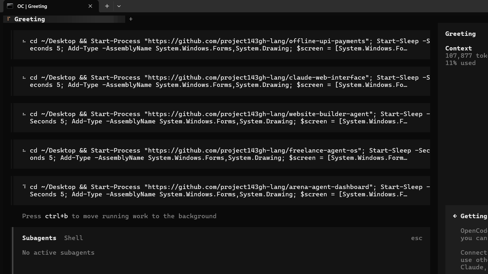

# Arena Agent Dashboard

A modern React/TypeScript dashboard for managing arena agents. Built with Vite and deployed on Vercel.

## 📸 Screenshot



**Start developing:** Run `npm install && npm run dev` to begin.

## Features

### 🎨 Modern UI
- **Beautiful, responsive design**: Works perfectly on mobile, tablet, and desktop
- **Glassmorphism effect**: Modern frosted glass dashboard layout
- **Smooth animations**: Subtle micro-interactions and page transitions
- **Dark/Light mode**: Automatic theme adaptation

### 📊 Agent Management
- **Configure agents**: Set agent parameters and limits
- **Usage tracking**: Monitor token usage, API calls, response times
- **Purchase flow**: Integrated payment processing for upgrades
- **Profile management**: User profiles and settings

### 📈 Dashboard Pages

#### Admin Panel
- Overall statistics and metrics
- Agent performance overview
- System health status
- Quick action shortcuts

#### Usage Center
- Detailed usage analytics
- Charts and graphs
- Resource consumption
- Optimization recommendations

#### Purchase Flow
- Plan selection and pricing
- Payment processing
- Subscription management
- Upgrade/downgrade options

#### Profile Center
- User information and settings
- Preferred themes and layouts
- Notification preferences
- Account security

#### Pricing Plans
- Tiered pricing structure
- Feature comparison
- Trial periods
- Annual vs monthly discounts

#### Device Configuration
- Agent device settings
- Resource allocation
- Performance tuning
- Compatibility modes

#### Brand Introduction
- Company branding options
- Custom color schemes
- Logo upload
- Brand messaging

#### API Key Settings
- Secure key management
- Permission levels
- Usage limits per key
- Rotation and rotation history

#### Account Preferences
- Notification settings
- Theme preferences
- Language selection
- Dashboard layout customization

## 🛠️ Tech Stack

- **Frontend**: React 18 + TypeScript
- **Build Tool**: Vite 5 for fast HMR
- **State Management**: React Query
- **Styling**: CSS Modules with custom properties
- **Icons**: Lucide React
- **Deployment**: Vercel (configured)

### 📁 Project Structure

```
arena agent bot/
├── src/
│   ├── components/       # React components (30+ components)
│   │   ├── AdminPanel.tsx        # Main admin dashboard
│   │   ├── UsageCenter.tsx       # Usage analytics center
│   │   ├── PurchaseFlow.tsx      # Payment and upgrade flow
│   │   ├── ProfileCenter.tsx     # User profile management
│   │   ├── PricingPlans.tsx      # Pricing tier display
│   │   ├── PaymentProcessing.tsx # Payment integration
│   │   ├── DeviceConfiguration.tsx # Agent device settings
│   │   ├── BrandIntro.tsx        # Brand customization
│   │   ├── ApiKeySettings.tsx    # API key management
│   │   ├── AccountPreferences.tsx # User preferences
│   │   ├── AboutArena.tsx        # About page
│   │   └── WaitingArcade.tsx     # Gamified waiting state
│   ├── pages/            # Page components (6 pages)
│   ├── lib/              # Utilities and APIs
│   │   └── supabase.ts   # Supabase client and helpers
│   ├── *.css             # Stylesheets (7 stylesheets)
│   ├── main.tsx          # Entry point with ReactDOM createRoot
│   ├── App.tsx           # Main app component with routing
│   └── index.css         # Global CSS and CSS variables
├── package.json          # Dependencies and scripts
├── vite.config.ts        # Vite configuration
├── tsconfig.json         # TypeScript configuration
├── tsconfig.node.json    # Node.js TypeScript config
├── tsconfig.app.json     # App TypeScript config
└── vercel.json           # Vercel deployment configuration
```

### 🔧 Environment Variables

Create a `.env` file in the root:

```env
VITE_SUPABASE_URL=your_supabase_project_url
VITE_SUPABASE_ANON_KEY=your_supabase_anon_public_key
```

### 📦 Dependencies

Key dependencies included:
- `react`: ^18.2.0
- `react-dom`: ^18.2.0
- `typescript`: ^5.2.0
- `vite`: ^5.0.0
- `@supabase/supabase-js`: ^2.39.0
- `lucide-react`: ^0.293.0
- `chart.js`: ^4.4.0
- `react-chartjs-2`: ^5.2.0

### 🛠️ Available Scripts

```bash
# Install dependencies
npm install

# Start development server
npm run dev

# Build for production
npm run build

# Preview production build
npm run preview

# Lint code
npm run lint
```

### 📊 Deployment

This project is fully configured for **Vercel** deployment:

1. Push to GitHub
2. Connect to Vercel
3. Automatic deployments
- Environment variables set in Vercel dashboard
- Automatic HTTPS
- Edge functions support
- Preview deployments on PRs

### 📜 License

MIT

---

**K.bhalavardt, MIT Student**